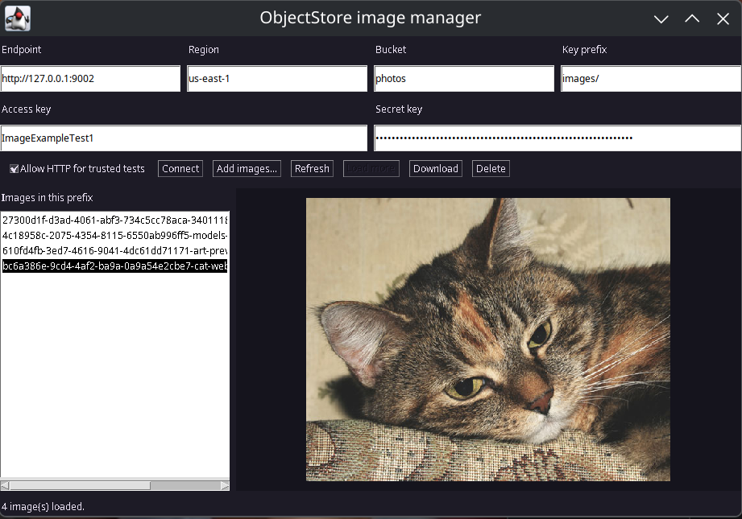

# Examples

## AWT image manager



Cat photo in the screenshot: [IOP Publishing source image](https://ioppublishing.org/wp-content/uploads/2017/03/cat-web-cc0.jpg).

Run from the ObjectStore repository root with JDK 21 or newer:

```sh
bash client/examples/awt-images/run.sh
```

The example uses only the Java client and the JDK. Enter an S3-compatible endpoint, region, existing bucket, and access keys. Use **Connect** to verify listing access. Drag PNG, JPEG, GIF, or BMP files onto the window, or use **Add images**. Select an object to preview it; use **Download** or **Delete** to manage it. Objects go under the specified key prefix with a short random ID, so uploading the same filename does not silently replace an earlier image. The list loads 100 objects at a time.

The example does not create a bucket. When launched directly, it keeps credentials in memory and requires explicit opt-in for plain HTTP. Use HTTP only with a trusted test service. Uploads are limited to 64 MiB per file, and previews to 12 MiB. This is a small interoperability test app, not a production asset manager.

### Local Docker test

Prerequisites: JDK 21 or newer, Bash, Python 3, `curl`, and a graphical desktop session. Docker must be running and accessible to your user, and `127.0.0.1:9002` must be free for the test container.

To try the app with a separate ObjectStore service, run:

```sh
bash client/examples/awt-images/run-test.sh
```

The launcher builds its local image if needed, starts a test container on `127.0.0.1:9002`, and opens the app connected to a `photos` bucket. Set `OBJECTSTORE_TEST_IMAGE` to use a different image. Closing the app leaves the container and its dedicated data volume running; run the launcher again to reconnect. Its generated test credentials are stored in the container's Docker configuration.

When finished, remove only this example's container and volume:

```sh
docker stop objectstore-image-example
docker rm objectstore-image-example
docker volume rm objectstore-image-example-data
```
